## Привет! Я Наталия Тарасова 👋

- Data Engineer, превращаю сырые данные в структурированные и полезные ресурсы для аналитики и бизнеса
- Готова к сотрудничеству
*********

### Languages and tools

&nbsp;
&nbsp;
&nbsp;
&nbsp;
&nbsp;
&nbsp;
&nbsp;
&nbsp;   
***********

### 🔄 ETL Pipeline example

```mermaid
flowchart LR
    %% Уровень 1: Источники данных
    A1[📥 Источник 1] --> A2[📥 Источник 2]
    subgraph Level1
        A1 --> A2
    end

    %% Уровень 2: Загрузка в облако
    B1[☁️ S3] --> B2[☁️ GCS]
    subgraph Level2
        B1 --> B2
    end

    %% Уровень 3: Трансформация
    C1[🧹 Очистка] --> C2[🔄 Обогащение]
    subgraph Level3
        C1 --> C2
    end

    %% Уровень 4: Хранилище и витрины
    D1[💾 PostgreSQL] --> D2[🏗️ ClickHouse/Greenplum]
    subgraph Level4
        D1 --> D2
    end

    %% Уровень 5: Визуализация
    E[📊 Superset/Metabase]

    %% Соединяем уровни слева направо
    A2 --> B1
    B2 --> C1
    C2 --> D1
    D2 --> E
```

Данная диаграмма показывает типовой ETL-процесс, реализованный мной в проектах.

********

          
          

